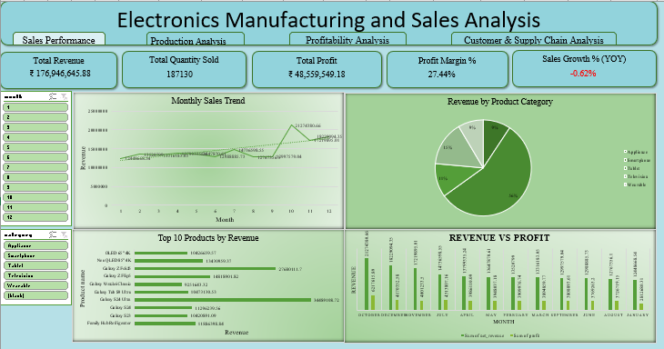
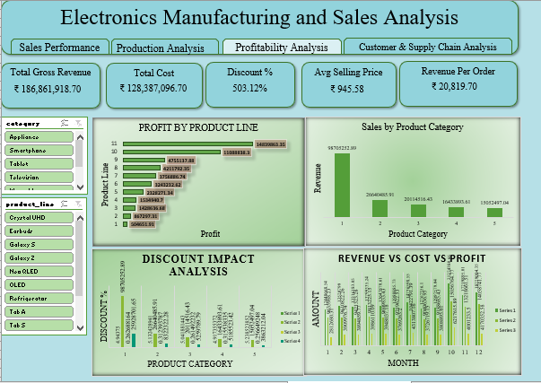
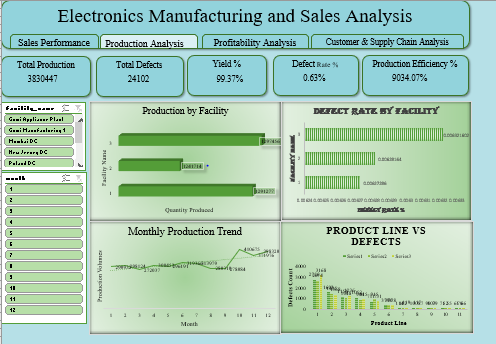
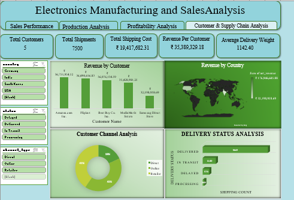

# 📊 Electronics Manufacturing Intelligence Hub

### Production • Sales • Profitability • Customer & Supply Chain Analytics | Excel

An end-to-end **Excel Manufacturing Analytics Dashboard** designed to analyze and monitor **production performance, sales, profitability, customer behavior, and supply chain operations** through interactive dashboards, KPIs, data modeling, and business-focused visualizations.

---

## 🚀 Project Overview

The **Electronics Manufacturing Intelligence Hub** transforms manufacturing and sales data into actionable business insights using **Advanced Excel, Power Query, Pivot Tables, Pivot Charts, DAX, and dashboard development**.

The solution provides a consolidated view of the organization's:

* 🏭 Production performance
* 📈 Sales performance
* 💰 Revenue and profitability
* 👥 Customer behavior
* 🚚 Shipment and delivery performance
* 📦 Product and product-line performance
* 📊 Year-over-year growth
* ⚙️ Manufacturing efficiency
* 🔍 Defect and quality analysis

The project follows a structured **star schema data model** using multiple fact and dimension tables to support scalable and interactive analytics.

---

## 🎯 Business Objectives

The dashboard was developed to help business stakeholders:

* Monitor overall sales and revenue performance
* Track production volume and manufacturing efficiency
* Analyze defects and quality performance
* Evaluate product and product-category profitability
* Identify high-performing products and product lines
* Analyze customer revenue and purchasing behavior
* Monitor shipment and delivery status
* Evaluate supply chain performance
* Understand cost and discount impact on profitability
* Track monthly sales and production trends
* Measure year-over-year sales growth
* Support data-driven strategic decision-making

---

## 🛠️ Tools & Technologies

| Category                | Tools / Technologies                                   |
| ----------------------- | ------------------------------------------------------ |
| Spreadsheet & Analytics | **Microsoft Excel, Advanced Excel**                    |
| Data Transformation     | **Power Query**                                        |
| Data Modeling           | **Star Schema, Fact & Dimension Tables**               |
| Calculations            | **DAX, Excel Formulas**                                |
| Data Analysis           | **Pivot Tables, Pivot Charts**                         |
| Dashboarding            | **Interactive Excel Dashboards**                       |
| Automation              | **ETL/ELT Automation, Power Query**                    |
| Visualization           | **Charts, KPI Cards, Conditional Formatting, Slicers** |

---

## 🧩 Data Model

The project uses a **star schema** to organize manufacturing, sales, customer, product, facility, and shipment information.

### Fact Tables

* **Fact Production**
* **Fact Sales**
* **Fact Shipment**

### Dimension Tables

* **Dim Product**
* **Dim Customer**
* **Dim Facility**
* **Dim Date**
* 
# 📊 Dashboard Modules

The project contains **four interactive analytical dashboards**.

---

## 1️⃣ Sales Performance Dashboard

The **Sales Performance Dashboard** provides a comprehensive overview of revenue, quantity sold, profitability, margins, and sales growth.

### Key KPIs

* **Total Revenue:** ₹176.95M
* **Total Quantity Sold:** 187,130
* **Total Profit:** ₹48.56M
* **Profit Margin:** 27.44%
* **Sales Growth (YOY):** -0.62%

### Key Analysis

* Monthly Sales Trend
* Revenue by Product Category
* Top 10 Products by Revenue
* Revenue vs Profit
* Year-over-Year Sales Growth
* Product Category Performance

### Dashboard Preview



---

## 2️⃣ Profitability Analysis Dashboard

The **Profitability Analysis Dashboard** focuses on understanding revenue, costs, discounts, selling prices, and product-level profitability.

### Key KPIs

* Total Gross Revenue
* Total Cost
* Discount %
* Average Selling Price
* Revenue per Order

### Key Analysis

* Profit by Product Line
* Sales by Product Category
* Discount Impact Analysis
* Revenue vs Cost vs Profit
* Product-Level Profitability
* Category-Level Revenue Performance

### Business Questions Addressed

* Which product lines generate the highest profit?
* Which categories contribute the most revenue?
* How does discounting affect profitability?
* How does cost compare with revenue and profit?
* Which products should receive greater business focus?

### Dashboard Preview



---

## 3️⃣ Production Analysis Dashboard

The **Production Analysis Dashboard** monitors manufacturing output, defects, yield, efficiency, and facility-level production performance.

### Key KPIs

* **Total Production:** 3.83M+
* **Total Defects:** 24K+
* **Yield %:** 99.37%
* **Defect Rate:** 0.63%
* Production Efficiency

### Key Analysis

* Production by Facility
* Defect Rate by Facility
* Monthly Production Trend
* Product Line vs Defects
* Manufacturing Yield
* Facility-Level Performance
* Quality and Defect Monitoring

### Business Questions Addressed

* Which facilities produce the highest volume?
* Which facilities have higher defect rates?
* How does production change month over month?
* Which product lines contribute the most defects?
* How effectively is manufacturing capacity being utilized?

### Dashboard Preview



---

## 4️⃣ Customer & Supply Chain Analysis Dashboard

This dashboard focuses on **customer revenue, shipment performance, delivery status, shipping costs, and geographical performance**.

### Key KPIs

* Total Customers
* Total Shipments
* Total Shipping Cost
* Revenue per Customer
* Average Delivery Weight

### Key Analysis

* Revenue by Customer
* Revenue by Country
* Customer Channel Analysis
* Delivery Status Analysis
* Shipment Performance
* Shipping Cost Analysis
* Customer-Level Revenue Contribution

### Business Questions Addressed

* Which customers generate the highest revenue?
* Which countries contribute the most revenue?
* Which customer channels perform best?
* What is the current shipment status?
* How efficiently are shipments being delivered?
* How much is being spent on shipping operations?

### Dashboard Preview



---

# 📌 Key Features

### 🔹 Interactive Dashboard Navigation

The dashboard provides dedicated sections for:

```text
Sales Performance
       ↓
Production Analysis
       ↓
Profitability Analysis
       ↓
Customer & Supply Chain Analysis
```

Users can navigate between analytical views and interact with filters and slicers.

### 🔹 Dynamic KPI Cards

KPI cards provide high-level visibility into important business metrics such as:

* Revenue
* Profit
* Profit Margin
* Quantity Sold
* Production
* Defects
* Yield
* Customers
* Shipments
* Shipping Cost

### 🔹 Interactive Filters

Slicers enable users to dynamically filter analysis by dimensions such as:

* Month
* Product
* Product Category
* Customer
* Facility
* Customer Channel
* Country

### 🔹 Trend Analysis

Time-based analysis is used to identify:

* Monthly sales trends
* Monthly production trends
* Revenue growth
* Profit trends
* Year-over-year performance

### 🔹 Product Analysis

Product-level analysis includes:

* Top products by revenue
* Product-line profitability
* Product category contribution
* Product-level defects
* Product performance comparison

---

# 📈 Analytical Techniques

The project applies multiple analytical techniques to transform raw manufacturing data into business insights.

### Sales Analytics

* Revenue Analysis
* Quantity Analysis
* Customer Revenue Analysis
* Product Revenue Analysis
* Category Contribution
* YOY Growth Analysis
* Monthly Trend Analysis

### Profitability Analytics

* Gross Revenue Analysis
* Cost Analysis
* Profit Analysis
* Profit Margin Analysis
* Discount Impact Analysis
* Product-Line Profitability
* Revenue vs Cost vs Profit

### Production Analytics

* Production Volume Analysis
* Facility Performance
* Defect Rate Analysis
* Yield Analysis
* Production Trend Analysis
* Product-Line Defect Analysis

### Customer Analytics

* Customer Revenue Analysis
* Customer Channel Analysis
* Customer Contribution
* Revenue per Customer
* Geographic Revenue Analysis

### Supply Chain Analytics

* Shipment Volume
* Delivery Status
* Shipping Cost
* Delivery Weight
* Shipment Performance

---

# 🔄 Data Preparation & Transformation

**Power Query** was used for data preparation and transformation workflows.

The data preparation process includes:

```text
Raw Data
   ↓
Data Import
   ↓
Data Cleaning
   ↓
Data Transformation
   ↓
Data Validation
   ↓
Data Modeling
   ↓
Calculated Metrics
   ↓
Pivot Tables / Pivot Charts
   ↓
Interactive Dashboard
```

### Data Preparation Activities

* Removed duplicate records
* Handled missing values
* Standardized column names
* Corrected data types
* Transformed date fields
* Created calculated columns
* Created analytical dimensions
* Prepared data for reporting
* Built reusable transformation workflows

---

# 🧮 KPI & DAX Analysis

The project uses calculated measures and analytical formulas to generate dynamic KPIs.

Examples include:

```text
Total Revenue
Total Cost
Total Profit
Profit Margin %
Sales Growth %
Total Quantity Sold
Total Production
Total Defects
Yield %
Defect Rate %
Revenue per Customer
Revenue per Order
Average Selling Price
Total Shipping Cost
```

Example profitability calculation:

```text
Profit = Revenue - Cost
```

Example profit margin:

```text
Profit Margin % = Profit / Revenue
```

Example defect rate:

```text
Defect Rate % = Total Defects / Total Production
```

---

# 💡 Key Business Insights

The dashboard enables stakeholders to identify:

### 💰 Revenue & Profitability

* High-performing products and categories
* Revenue contribution by product category
* Profitability differences across product lines
* Cost and discount impact on profitability

### 🏭 Manufacturing

* High-volume manufacturing facilities
* Facility-level defect rates
* Production trends over time
* Product lines with higher defect volumes

### 👥 Customers

* High-value customers
* Customer revenue contribution
* Performance across customer channels
* Geographic revenue distribution

### 🚚 Supply Chain

* Shipment volumes
* Delivery status distribution
* Shipping cost performance
* Delivery weight patterns

---

# 📂 Repository Structure

```text
Electronics-Manufacturing-Intelligence-Hub/
│
├── 📊 Electronics Manufacturing and Sales Analysis.xlsx
│
├── 🖼️ Customer_and_Supplychain_Analysis_Dashboard.PNG
├── 🖼️ Sales_Analysis_Dashboard.PNG
├── 🖼️ Profitability_Analysis_Dashboard.PNG
├── 🖼️ Production_Analysis_Dashboard.PNG
│
└── 📄 README.md
```

---

# 🖼️ Dashboard Gallery

## Sales Performance


## Profitability Analysis


## Production Analysis


## Customer & Supply Chain Analysis


---

# 🎯 Skills Demonstrated

This project demonstrates practical experience in:

* Advanced Microsoft Excel
* Power Query
* DAX
* Data Cleaning
* Data Transformation
* Data Modeling
* Star Schema Design
* Fact & Dimension Modeling
* Pivot Tables
* Pivot Charts
* KPI Development
* Dashboard Development
* Business Intelligence
* Sales Analytics
* Manufacturing Analytics
* Profitability Analytics
* Customer Analytics
* Supply Chain Analytics
* Time-Series Analysis
* YOY Growth Analysis
* Data Visualization
* Business Reporting

---

# 👨‍💻 Project Highlights

### End-to-End Analytics Solution

Developed a complete analytics solution covering the entire workflow:

```text
Data
 ↓
Power Query
 ↓
Data Cleaning & Transformation
 ↓
Star Schema Data Model
 ↓
DAX / Calculations
 ↓
Pivot Tables
 ↓
Pivot Charts
 ↓
Interactive Dashboards
 ↓
Business Insights
```

### Business-Focused Analytics

Rather than focusing only on visualization, the project connects **operational metrics with business questions**, enabling stakeholders to understand what is happening across sales, manufacturing, profitability, customers, and supply chain operations.

---

# 📌 Project Type

**Excel Business Intelligence & Manufacturing Analytics Project**

**Domain:** Electronics Manufacturing & Sales

**Primary Tool:** Microsoft Excel

**Analytics Areas:**

```text
Manufacturing
Sales
Profitability
Customers
Supply Chain
Operations
Business Intelligence
```

---

# ⭐ Why This Project Matters

This project demonstrates the ability to transform complex manufacturing and sales data into an **interactive, decision-support analytics solution**.

It showcases how Excel can be used beyond traditional spreadsheet reporting by combining:

**Power Query + Data Modeling + DAX + Pivot Tables + Interactive Dashboards**

to create a structured **Business Intelligence solution** for manufacturing organizations.

---

## 📬 Connect With Me

If you are interested in **Data Analytics, Business Intelligence, Manufacturing Analytics, or Dashboard Development**, feel free to connect with me on GitHub and LinkedIn.

---

## ⭐ If You Find This Project Useful

If this project helps you, consider giving the repository a **⭐ Star** and sharing your feedback.

---

**Built with Microsoft Excel | Power Query | DAX | Pivot Tables | Pivot Charts | Business Intelligence**
